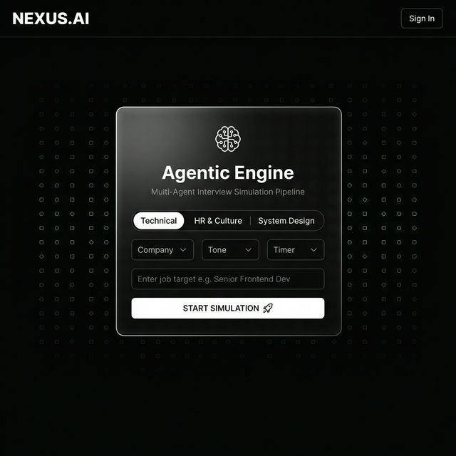

# NEXUS.AI — Agentic Interview Simulation Platform

> **Live Demo → [ai-interview-platform-nr7v.vercel.app](https://ai-interview-platform-nr7v.vercel.app)**  
> **GitHub → [sakshigupta372/ai-interview-platform](https://github.com/sakshigupta372/ai-interview-platform)**



---

## What is this?

NEXUS.AI is a **production-grade, agentic AI interview simulation engine** powered by Google Gemini. It runs a full multi-agent pipeline to generate adaptive questions, evaluate your answers in real time, and build a neural profile of your strengths and weaknesses — across 5 progressively harder questions.

---

## Key Features

### 🧠 Multi-Agent AI Pipeline
- **Agent 1 — Generator:** Creates a role-specific opening question
- **Agent 2 — Evaluator:** Scores your answer (0–10) with detailed feedback, detects strengths/weaknesses
- **Agent 3 — Follow-up:** Generates the next adaptive question based on your performance and target difficulty

### 🎤 Full 2-Way Voice Mode
- AI speaks every question aloud via **Neural Speech Synthesis**
- You respond via the **Microphone** button using Web Speech API
- Real-time **Clarity** and **Confidence** meters update as you type/speak

### 🏢 Company & Persona Targeting
- Choose target company: **Google, Amazon, Stripe** or Agnostic
- Pick interviewer tone: **Harsh Tech Lead, Friendly HR, Chaotic Startup Founder**
- Select interview type: **Technical, HR & Culture, System Design**

### ⏱️ Adaptive Difficulty + Timer
- AI escalates difficulty dynamically based on your score
- Timer modes: **Practice (no timer), Pressure (2 min), Rapid Fire (30s)**

### 🔐 Clerk Authentication (BYOK Model)
- Users sign in via **Clerk** (Google / GitHub / Email)
- After login, users paste their own **Gemini API key** — zero platform rate limits
- Each session is tied to the user's `clerkId` in MongoDB

### 📊 Profile Dashboard
- Full history of every interview session
- Average scores, peak difficulty, global strengths/weaknesses
- Per-question score dots visualization

---

## Tech Stack

| Layer | Technology |
|---|---|
| Frontend | Next.js 15 (App Router) |
| Styling | Vanilla CSS + Inline Styles |
| Auth | Clerk |
| AI Engine | Google Gemini (`gemini-2.5-flash`) |
| Backend | Node.js + Express.js |
| Database | MongoDB (Mongoose) |
| Animations | Framer Motion |
| Voice | Web Speech API + SpeechSynthesis |
| Deployment | Vercel (frontend) + Render (backend) + MongoDB Atlas |

---

## Architecture

```
User Browser
  ↓  Clerk Auth Gate
  ↓  API Key Gate (BYOK)
Vercel → Next.js Frontend
  ↓  axios POST
Render → Express Backend
  ├── Agent 1: generateQuestion()    ← Gemini
  ├── Agent 2: evaluateAnswer()      ← Gemini  
  └── Agent 3: generateFollowUp()   ← Gemini
  ↓
MongoDB Atlas → Sessions Collection
```

---

## Running Locally

### Prerequisites
- Node.js 18+
- MongoDB running locally (`mongod`)
- A free [Gemini API key](https://aistudio.google.com/app/apikey)
- A free [Clerk account](https://clerk.com)

### Backend
```bash
cd server
npm install
# Create server/.env with:
# MONGO_URI=mongodb://localhost:27017/ai-interview-platform
# PORT=5000
node index.js
```

### Frontend
```bash
cd client
npm install
# Create client/.env.local with:
# NEXT_PUBLIC_CLERK_PUBLISHABLE_KEY=pk_test_...
# CLERK_SECRET_KEY=sk_test_...
# NEXT_PUBLIC_API_URL=http://localhost:5000
npm run dev
```

Open [http://localhost:3000](http://localhost:3000)

---

## Environment Variables

### Frontend (`client/.env.local`)
```env
NEXT_PUBLIC_CLERK_PUBLISHABLE_KEY=
CLERK_SECRET_KEY=
NEXT_PUBLIC_API_URL=https://your-backend.onrender.com
```

### Backend (`server/.env`)
```env
MONGO_URI=mongodb+srv://...
PORT=5000
FRONTEND_URL=https://your-app.vercel.app
```

---

## Deployment

| Service | Purpose | Cost |
|---|---|---|
| [Vercel](https://vercel.com) | Frontend hosting | Free |
| [Render](https://render.com) | Backend hosting | Free |
| [MongoDB Atlas](https://cloud.mongodb.com) | Cloud database | Free |
| [Clerk](https://clerk.com) | Authentication | Free (10k MAU) |

**Total: $0/month**

### Connect Vercel to GitHub (auto-deploy on push)

1. Open [Vercel Dashboard](https://vercel.com/dashboard) → your project (`ai-interview-platform-nr7v`)
2. **Settings → Git** → **Connect Git Repository**
3. Select **`sakshigupta372/ai-interview-platform`** and branch **`main`**
4. **Settings → General → Root Directory** → set to **`client`** (monorepo)
5. **Settings → Environment Variables** (Production):

   | Variable | Value |
   |---|---|
   | `NEXT_PUBLIC_CLERK_PUBLISHABLE_KEY` | from [Clerk dashboard](https://dashboard.clerk.com) |
   | `CLERK_SECRET_KEY` | from Clerk dashboard |
   | `NEXT_PUBLIC_API_URL` | your Render backend URL (e.g. `https://xxx.onrender.com`) |

6. On **Render** (backend), set `FRONTEND_URL=https://ai-interview-platform-nr7v.vercel.app`
7. Push to `main` on GitHub — Vercel rebuilds automatically

Copy env templates from `client/.env.example` and `server/.env.example`.

---

## License

MIT — built with ❤️ by [@sakshigupta372](https://github.com/sakshigupta372)
